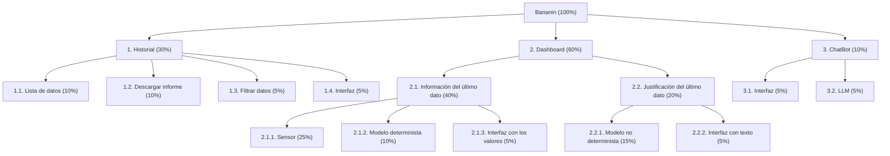

```mermaid
flowchart TD
    A["Bananin (100%)"]
    A --> B["1. Historial (30%)"]
    A --> C["2. Dashboard (60%)"]
    A --> D["3. ChatBot (10%)"]

    B --> B1["1.1. Lista de datos (10%)"]
    B --> B2["1.2. Descargar informe (10%)"]
    B --> B3["1.3. Filtrar datos (5%)"]
    B --> B4["1.4. Interfaz (5%)"]

    C --> C1["2.1. Información del último dato (40%)"]
    C --> C2["2.2. Justificación del último dato (20%)"]
    C1 --> C11["2.1.1. Sensor (25%)"]
    C1 --> C12["2.1.2. Modelo determinista (10%)"]
    C1 --> C13["2.1.3. Interfaz con los valores (5%)"]
    C2 --> C21["2.2.1. Modelo no determinista (15%)"]
    C2 --> C22["2.2.2. Interfaz con texto (5%)"]

    D --> D1["3.1. Interfaz (5%)"]
    D --> D2["3.2. LLM (5%)"]
```